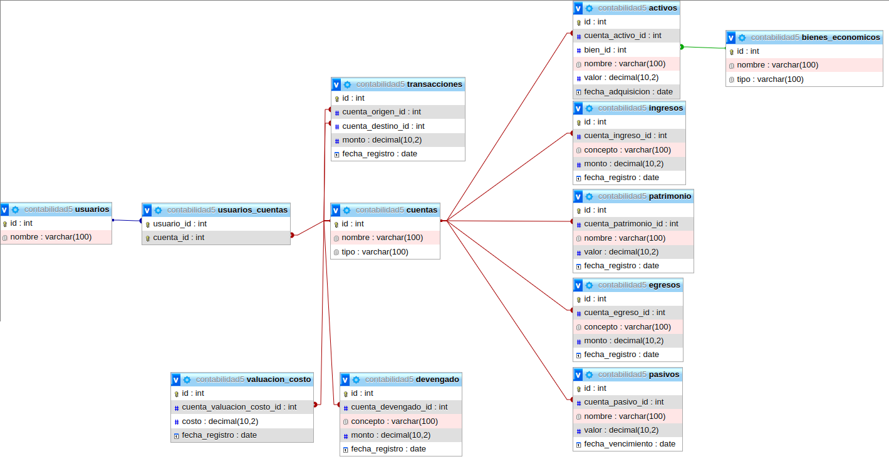

# HAE de Contabilidad Empresarial

La HAE de Contabilidad Empresarial es una aplicación administrativa diseñada para ayudar a las empresas a gestionar sus registros contables, seguimiento de transacciones y generar informes financieros. Esta API proporciona funcionalidades para crear y administrar cuentas contables, registrar transacciones y generar balances.

## Objetivo

El objetivo principal de este proyecto es ofrecer a las empresas una herramienta eficiente y fácil de usar para llevar el control contable de sus operaciones. Al utilizar esta "herramienta", los usuarios podrán realizar tareas como:

- Crear y gestionar cuentas contables.
- Registrar transacciones financieras, especificando las cuentas involucradas y los montos correspondientes.
- Generar informes y balances para evaluar la salud financiera de la empresa.

## Próximos 6 días

Durante los próximos 6 días, se trabajarán en las siguientes tareas para mejorar y expandir la funcionalidad de la API:

1. **Día 1**: Implementar endpoints para crear, actualizar y eliminar cuentas contables.
2. **Día 2**: Desarrollar funcionalidades para registrar transacciones financieras y asociarlas con las cuentas correspondientes.
3. **Día 3**: Implementar un endpoint para generar el balance general de la empresa en una fecha específica.
4. **Día 4**: Añadir validaciones y manejo de errores a los endpoints existentes para garantizar la integridad de los datos.
5. **Día 5**: Mejorar la seguridad de la API mediante la implementación de autenticación y autorización.
6. **Día 6**: Realizar pruebas exhaustivas y corregir posibles errores o mejoras sugeridas.
7.   **Día 7**: Implementar funcionalidades para generar informes detallados de transacciones por categoría y período de tiempo.
8.   **Día 8**: Optimizar el rendimiento de la API y realizar ajustes para mejorar la escalabilidad del sistema.

Ten en cuenta que estos objetivos son flexibles y podrían estar sujetos a cambios o ajustes según las necesidades del proyecto.

## Estructura de DB

Son el mismo sql pero se muestran de forma distinta

### Forma 2

